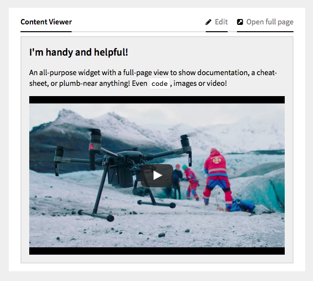

# Content Viewer Kirby Widget

A nifty little [Kirby](https://getkirby.com) widget that allows you to show a block of Kirbytext or Markdown content in Kirby's panel. It is particularly useful for providing documentation for website editors.

## Installation and Setup

Clone or [download](https://github.com/CalebGrove/content-viewer/archive/master.zip) this repo, rename the folder to `content-viewer`, and move it into your `/site/plugins/` folder. If you are using the [Kirby CLI](https://github.com/getkirby/cli), you can install it with this command:

	kirby plugin:install CalebGrove/content-viewer

Now, open up the panel and you should see the new widget on the dashboard. To change the content, click on the **Edit** button at the top-right of the widget. **This option will *only* be visible to users with the role of administrator.**

If you want to customize the CSS, you may do so by copying the  `styles.css` file from this plugin's `assets` folder to `/assets/plugins/content-viewer/styles.css`. Kirby will now serve your version of the file, and updating this plugin won't overwrite it.

## Changelog

### [1.2.2](https://github.com/CalebGrove/content-viewer/releases/tag/1.2.2)

* [Fixes widget breaking on first load in newer versions of Kirby.](https://github.com/calebgrove/content-viewer/issues/4)

### [1.2.1](https://github.com/CalebGrove/content-viewer/releases/tag/1.2.1)
3/28/17

* Hotfix for [breaking multi-lang websites](https://github.com/CalebGrove/content-viewer/issues/2).

### [1.2.0](https://github.com/CalebGrove/content-viewer/releases/tag/1.2.0)

* [Much DRYer CSS](https://github.com/CalebGrove/content-viewer/issues/1).
* The content page will no longer be visible in the panel, instead, users with the role of Administrator will see a new **Edit** option for the widget.
* The full page view is no longer publicly visible. Now, the user must be logged in and have panel access to view it.
* When the plugin is loaded for the first time, it will create the page automatically and prompt you to edit it.
* Advanced config options were removed as my implementation of them was just too buggy.
